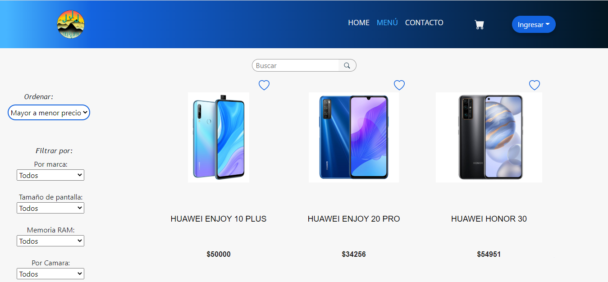
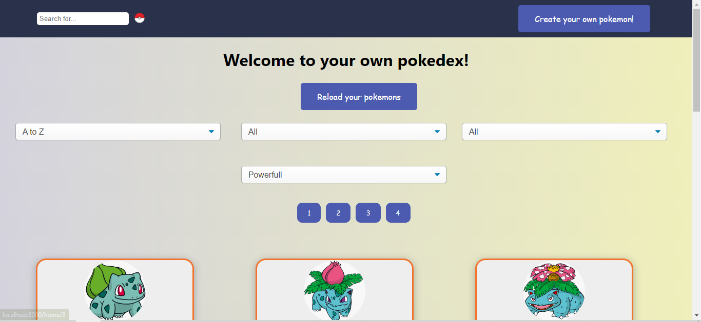
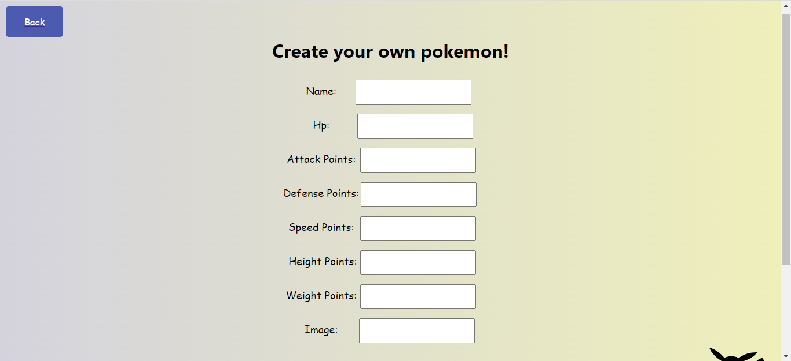

 **Hola, Soy [Gino Borgogno](https://www.linkedin.com/in/gino-borgogno-ba4bb8206//)** 

Estudiante avanzado de Ingenieria Civil incursionando en el apasionante mundo de la programación como FullStack Developer. 
Me agradan los grandes desafíos y los emprendo con pasión, compromiso y determinación. 
Estoy interesado en el desarrollo web 🖥️, tanto desde el lado de Front-end como del Back-end. 

      

 

## Lenguajes y herramientas

## 📌 Mis Proyectos

### Henry E-Commerce :dollar: :credit_card: :chart:
Nace como proyecto grupal integrador para poner en practica todas las habilidades adquiridas en el bootcamp Henry.
Comprende Carrito de compras, Login para usuario comun y administrativo, Pasarela de Pago (Mercado Pago)
En este gran proyecto me desempeñe como Full Stack developer, trabajamos mediante la metodología SCRUM con las siguientes tecnologías: 
Javascript | React Native | CSS | Redux | Node | Sequelize | PostgreSQL | Git Hub | Trello

Link al [Deploy](https://tresjota-ecommerce.vercel.app/)

### Henry Pokémon
Single-page application enfocada en las razas de perros de todo el mundo. 
Desarrolle íntegramente esta aplicación tanto frontend como backend, con las siguientes tecnologías: 
Javascript | HTML | CSS | React | Redux | Node | Sequelize | PostgreSQL 

